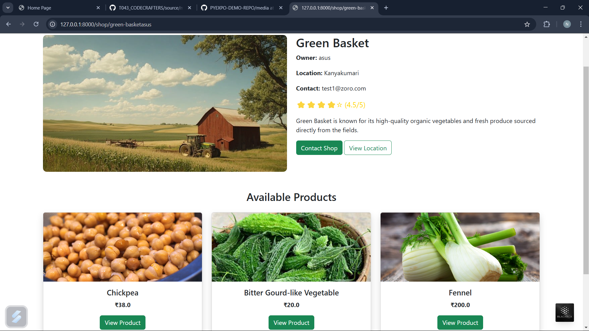

---

## Problem Statement

*Problem Statement ID – PY009*

Formulate your problem statement clearly and concisely.

---

## Overview

The Local Marketplace for Farmers is a web-based platform that enables farmers to list their produce and sell directly to consumers, eliminating intermediaries and ensuring better pricing. The platform includes features such as product listing, real-time chat, secure payments, and order tracking to enhance the experience for both farmers and buyers.

---

## Proposed Solution

-For Farmers: Easy product listing, fair pricing, direct consumer interactions, and secured payments.

-For Consumers: Access to fresh farm produce, competitive pricing, and the ability to connect directly with farmers.

-For Admins: Platform management, user verification, and analytics dashboard.

---

## Team Members

*Team ID – T043*

List your team members along with their roles.

- *NaveenKumar G* - Team Leader
- *Shakthi G* - Team member
- *Yashwini Choudhary B* - Team member
- *Nisha M* - Team member
- *Omar Farroq S H* - Team member
- *Naresh Kalyan S M* - Team member

---

## Technical Stack

List the technologies and tools used in the project. For example:

- *Frontend:* HTML, CSS, Bootstrap 
- *Backend:* Django
- *Database:* MySQL
- *Other Tools:* Git

---

## Getting Started

Follow these steps to clone and run the application locally.

### Prerequisites

1. Install [Python](https://www.python.org/downloads/).
2. Install [Git](https://git-scm.com/).
3. Clone this repository:
   bash
   git [clone https://github.com/username/repository-name.git](https://github.com/PYEXPO25/T043_CODECRAFTERS.git)
   

### Installation

1. Navigate to the project directory:
   bash
   cd repository-name
   
2. Create a virtual environment:
   bash
   python -m venv venv
   
3. Activate the virtual environment:
   - On Windows:
     bash
     venv\Scripts\activate
     
   - On macOS/Linux:
     bash
     source venv/bin/activate
     
4. Install dependencies:
   bash
   pip install -r requirements.txt
   
5. Navigate to source
   bash
   cd source
   

---

## Start the Application

1. Run the Django application:
   bash
   python manage.py runserver
   
2. Open your browser and navigate to:
   
   http://127.0.0.1:5000/
   

---

## UI Overview

Images to demonstrate the user interface:

*Example pages:*

1. *Landing Page:*
   

2. *Dashboard:*
   

3. *Analytics View:*
   

---

## Resources

### 📄 PowerPoint Presentation
[Click here to view the PPT](insert-drive-link-here)

### 🎥 Project Video
[Click here to view the project demo video](insert-drive-link-here)

### 📹 YouTube Link
[Watch the project on YouTube](insert-youtube-link-here)

---
